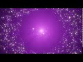

# Workouts Blender 2.8 Particle System

My Work results (Click on the thumb-nails to see the video) with the actual Blender 2.8 beta Version( 2019-06-01):

---

* from [Blender Particles Tutorial - Blender 2.8 Beginners Tutorial](https://www.youtube.com/watch?v=5kfy3wxicMw) by DCP Web Designers 
**My rating**: 10/10 - Top Tutorial. Absolut suitable for beginning with the blender 2.8 Particle System

---

* from [Blender Particles Tutorial - Blender 2.8 Eevee](https://www.youtube.com/watch?v=WjA_mRwKu8c) by DCP Web Designers 
**My rating**: 10/10 - Top Tutorial. Absolut suitable for beginning with the blender 2.8 Particle System

---
