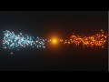

# Introduction to Blender 2.8 Particle System

My Work result (Click on the thumb-nail to see the video)

from:

[Blender Particles Tutorial - Blender 2.8 Beginners Tutorial](https://www.youtube.com/watch?v=5kfy3wxicMw)
by DCP Web Designers, 

**My rating**: 10/10 - Top Tutorial. Absolut suitable for beginning with the blender 2.8 Particle System

---
